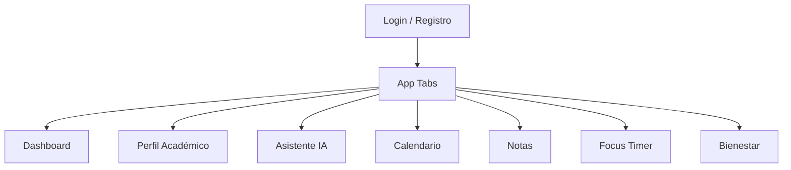

# UX/UI FocusU

## Principios

- Reducir fatiga de configuración.
- Mostrar lo importante del día antes que menús extensos.
- Usar tarjetas sólidas por curso, carpetas visuales y jerarquía clara.
- Mantener una estética educativa minimalista: fondo claro, azul marino, verde profundo y marrones suaves.

## Flujo de navegación

## Pantallas

- Login: marca FocusU, valor principal, login, registro y recuperación.
- Dashboard: calendario del día, próximos bloques, estadísticas rápidas, frase diaria, recomendación IA y accesos rápidos.
- Perfil académico: datos, carrera, ciclo, progreso, malla y hasta 7 cursos activos.
- Estudio: carpetas por curso, documentos, resumen, flashcards, plan y chat RAG.
- Calendario: vistas día/semana, clases recurrentes y bloques de estudio.
- Notas: evaluaciones por curso, pesos, promedio, ponderado general y proyección final.
- Focus Timer: temporizador, curso asociado, estado de bloqueo simulado e historial.
- Bienestar: mood tracking, respiración, pausas y recomendaciones.

